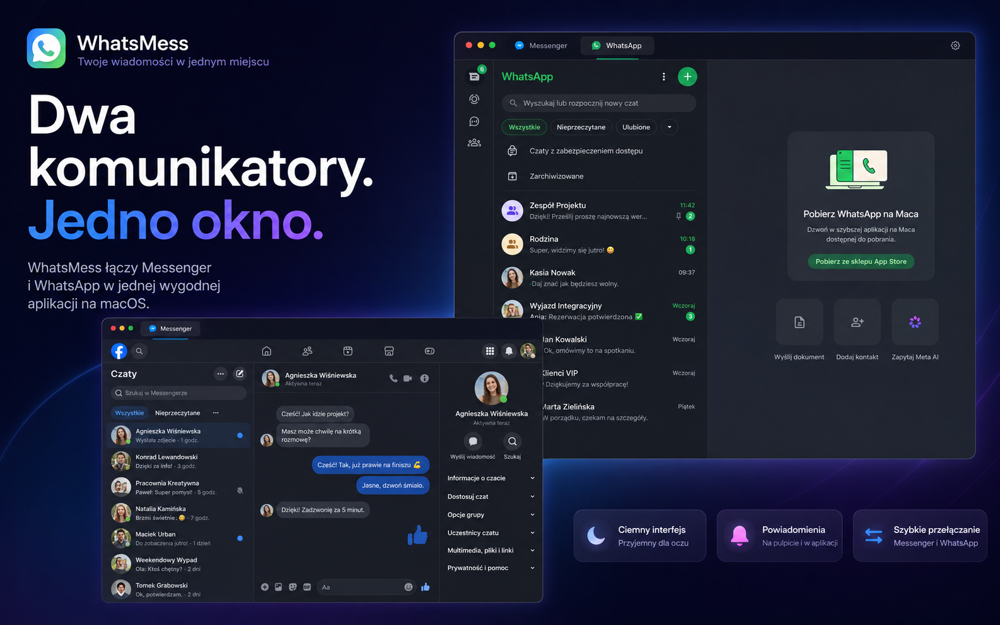
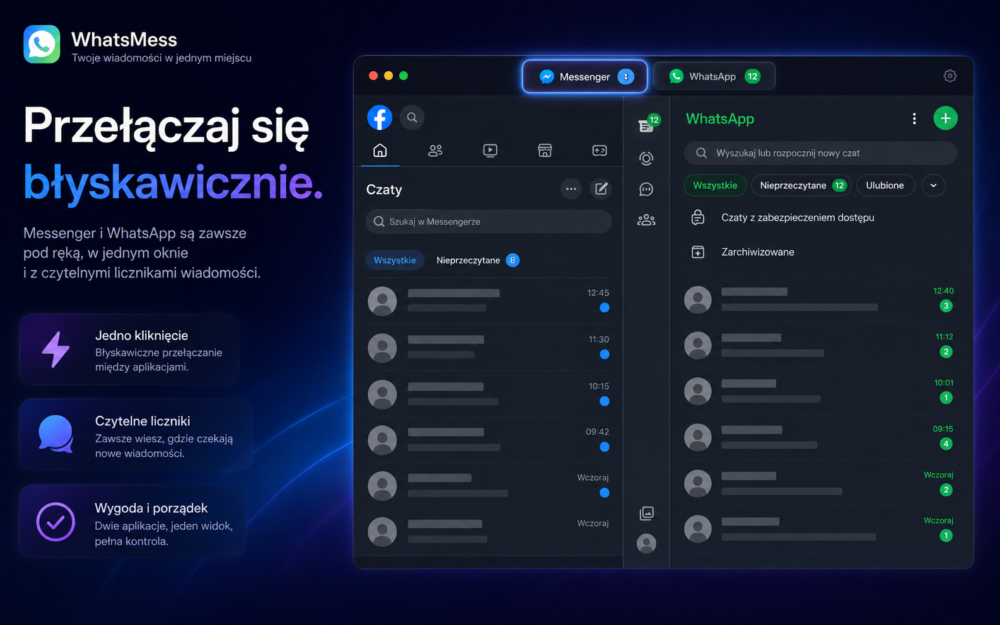
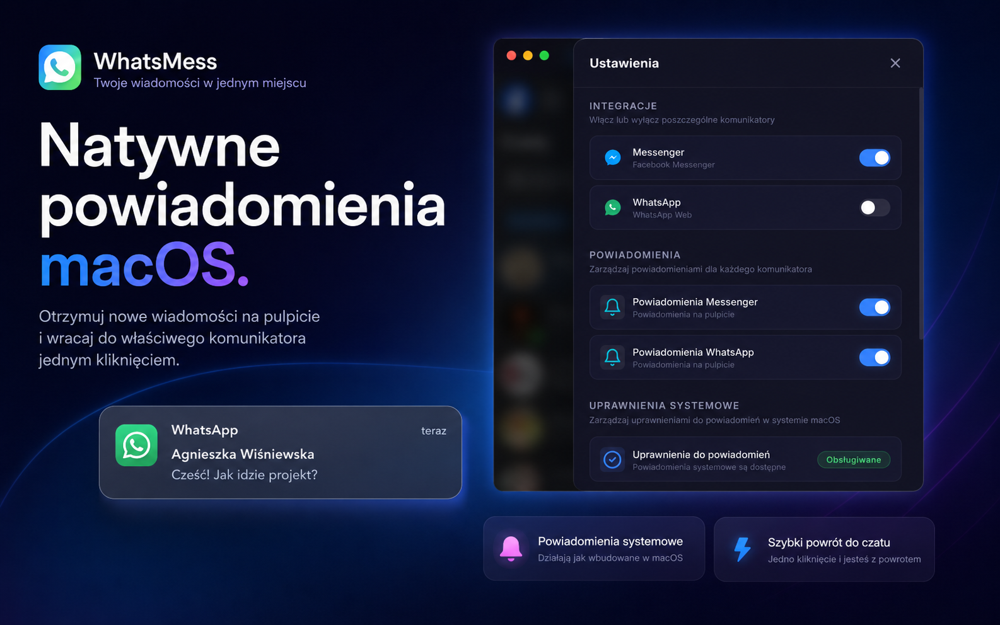
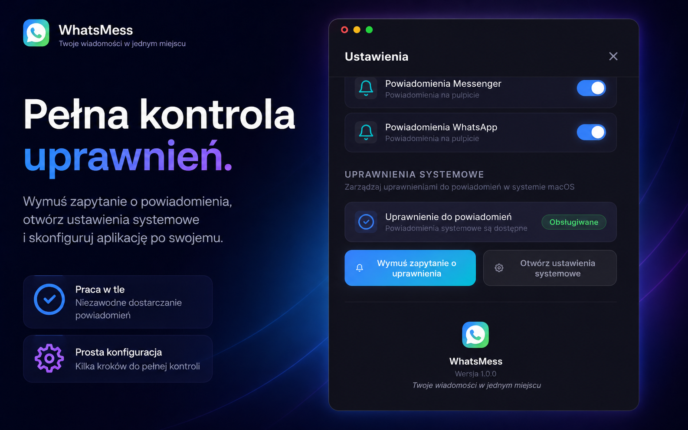

# WhatsMess - Komunikatory w jednym oknie na macOS

WhatsMess to darmowa aplikacja desktopowa na macOS, która łączy Facebooka Messenger i WhatsApp w jednym wygodnym oknie. Zbudowana w oparciu o Electron, zapewnia natywne powiadomienia systemowe, szybkie przełączanie między komunikatorami i nowoczesny, ciemny interfejs.

---

## Zrzuty ekranu









---

## Funkcje

- **Messenger i WhatsApp w jednej aplikacji** - nie musisz już przeskakiwać między przeglądarką a osobnymi oknami. Wszystkie rozmowy są dostępne w jednym miejscu.
- **Natywne powiadomienia macOS** - aplikacja wysyła powiadomienia systemowe o nowych wiadomościach. Kliknięcie powiadomienia przenosi do odpowiedniej zakładki.
- **Zarządzanie uprawnieniami powiadomień** - wbudowany przycisk do wymuszenia zapytania systemowego o pozwolenie na powiadomienia oraz szybki dostęp do ustawień systemowych.
- **Ciemny interfejs** - nowoczesny, minimalistyczny design dopasowany do systemu macOS.
- **Zakładki z licznikami** - widoczna liczba nieprzeczytanych wiadomości dla każdego komunikatora.
- **Niezależne sesje** - każdy komunikator działa w oddzielnej sesji, co oznacza niezależne logowanie i przechowywanie danych.
- **Konfiguracja przy pierwszym uruchomieniu** - kreator pozwala wybrać, które komunikatory chcesz używać.
- **Praca w tle** - zamknięcie okna minimalizuje aplikację do Docka zamiast ją kończyć.

---

## Wymagania systemowe

- macOS 10.13 (High Sierra) lub nowszy
- Architektura Apple Silicon (arm64) lub Intel (x64)

---

## Instalacja

### Gotowa paczka DMG

1. Pobierz najnowszy plik DMG z zakładki [Releases](https://github.com/k0rdian/WhatsMess/releases).
2. Otwórz plik DMG i przeciągnij aplikację do folderu Aplikacje.
3. Uruchom WhatsMess z Launchpada lub folderu Aplikacje.

Uwaga: przy pierwszym uruchomieniu macOS może wyświetlić ostrzeżenie o nieznanym deweloperze. Aby je ominąć, kliknij prawym przyciskiem myszy na aplikację i wybierz "Otwórz".

### Budowanie ze źródła

```bash
git clone https://github.com/k0rdian/WhatsMess.git
cd WhatsMess
npm install
npm run build:mac
```

Gotowy plik DMG znajdziesz w katalogu `dist/`.

---

## Uruchamianie w trybie deweloperskim

```bash
npm install
npm start
```

---

## Struktura projektu

```
WhatsMess/
├── build/                  # Zasoby budowania (ikony, uprawnienia)
│   ├── icon.icns           # Ikona aplikacji
│   └── entitlements.mac.plist
├── src/
│   ├── assets/             # Zasoby aplikacji
│   │   └── ikona.png       # Ikona wyświetlana w interfejsie
│   ├── main.js             # Proces główny Electron
│   ├── preload.js          # Skrypt preload (most IPC)
│   ├── webview-preload.js  # Skrypt preload dla webview (przechwytywanie powiadomień)
│   ├── renderer.js         # Logika interfejsu
│   ├── index.html          # Struktura interfejsu
│   └── styles.css          # Style CSS
├── package.json
└── README.md
```

---

## Jak działają powiadomienia

WhatsMess przechwytuje powiadomienia z Messengera i WhatsApp na dwa sposoby:

1. **Przechwytywanie API Notification** - skrypt wstrzyknięty do webview nadpisuje natywny obiekt `Notification` przeglądarki i przekazuje dane do procesu głównego Electron, który wyświetla natywne powiadomienie macOS.

2. **Monitorowanie tytułu strony** - aplikacja śledzi zmiany w tytule strony (np. "(3) Messenger"), wykrywa nowe nieprzeczytane wiadomości i generuje powiadomienie.

Jeśli macOS nie wyświetla powiadomień, wejdź w Ustawienia aplikacji i użyj przycisku "Wymuś zapytanie o uprawnienia" w sekcji "Uprawnienia systemowe". Możesz też otworzyć ustawienia systemowe powiadomień bezpośrednio z aplikacji.

---

## Ustawienia

Panel ustawień (ikona zębatki w prawym górnym rogu) pozwala na:

- Włączanie i wyłączanie poszczególnych komunikatorów
- Zarządzanie powiadomieniami dla każdego komunikatora osobno
- Wymuszenie zapytania o uprawnienia do powiadomień systemowych
- Otwarcie ustawień systemowych macOS dotyczących powiadomień

---

## Użyte technologie

- [Electron](https://www.electronjs.org/) - framework do budowania aplikacji desktopowych z użyciem technologii webowych
- [electron-builder](https://www.electron.build/) - narzędzie do pakowania i dystrybucji aplikacji Electron
- HTML, CSS, JavaScript - interfejs użytkownika

---

## Licencja

Projekt udostępniony na licencji MIT. Szczegóły w pliku [LICENSE](LICENSE).

---

## Autor

Stworzone przez [k0rdian](https://github.com/k0rdian).
