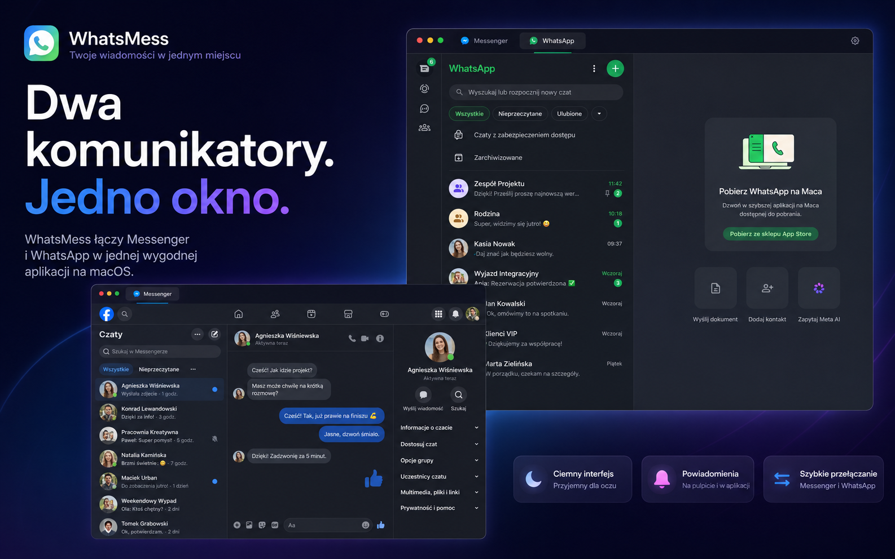
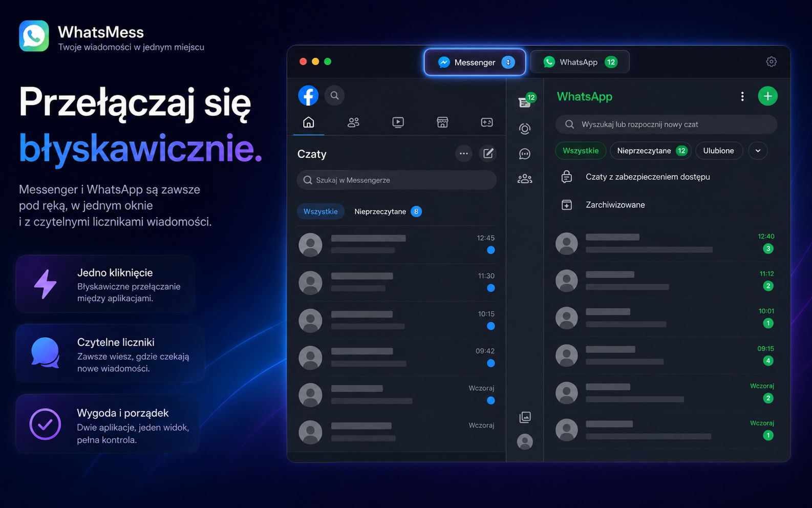
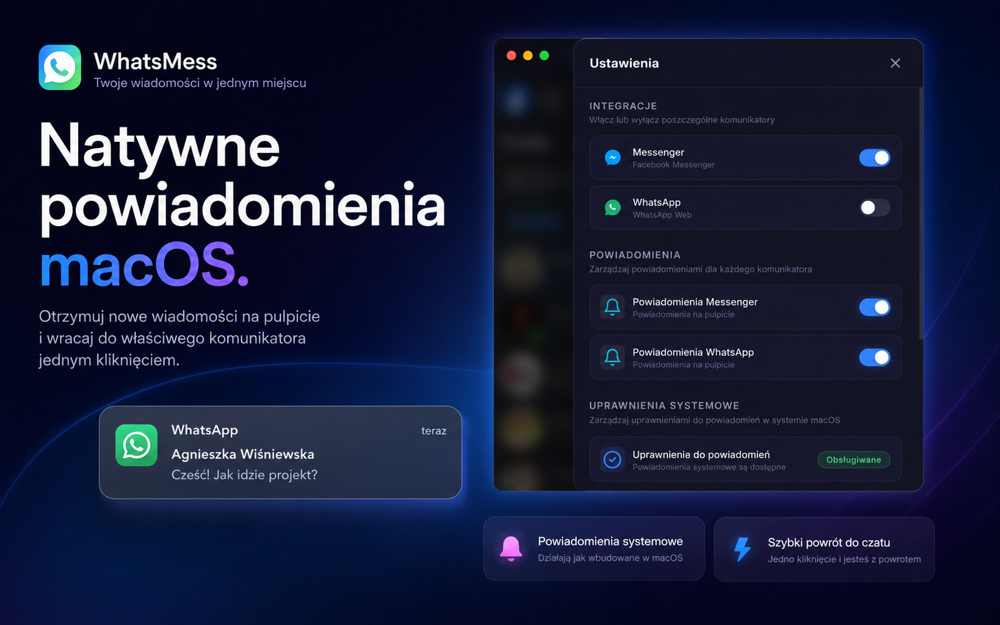
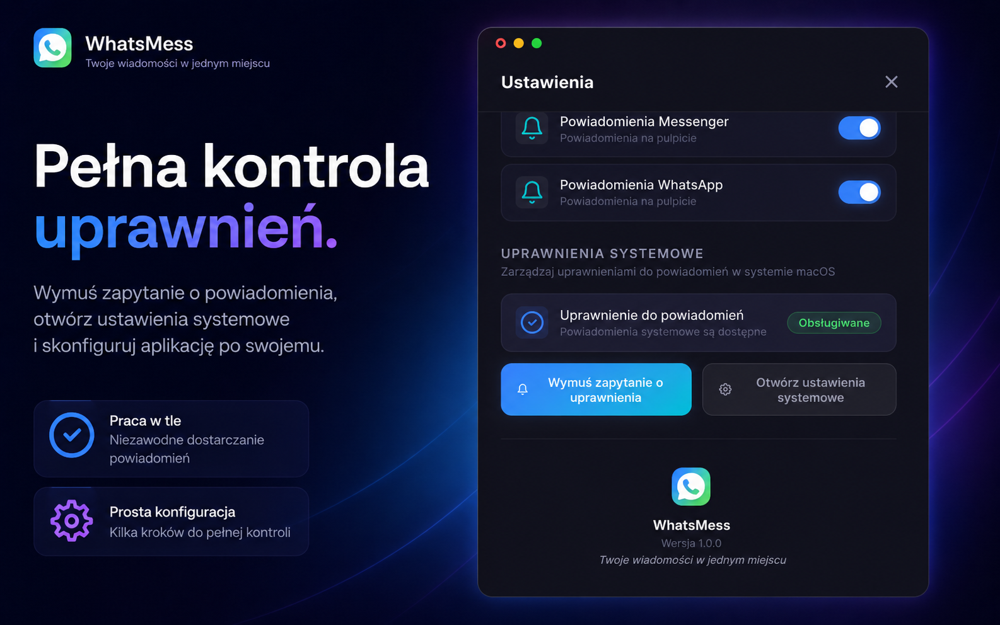

# WhatsMess - Komunikatory w jednym oknie na macOS

WhatsMess to darmowa aplikacja desktopowa na macOS, która łączy Facebooka Messenger i WhatsApp w jednym wygodnym oknie. Zbudowana w oparciu o Electron, zapewnia natywne powiadomienia systemowe, szybkie przełączanie między komunikatorami i nowoczesny, ciemny interfejs.

---

## Zrzuty ekranu









---

## Funkcje

- **Messenger i WhatsApp w jednej aplikacji** - nie musisz już przeskakiwać między przeglądarką a osobnymi oknami. Wszystkie rozmowy są dostępne w jednym miejscu.
- **Natywne powiadomienia macOS z treścią wiadomości** - powiadomienie pokazuje nadawcę, treść i zdjęcie profilowe. Kliknięcie otwiera właściwą rozmowę.
- **Zarządzanie uprawnieniami powiadomień** - wbudowany przycisk do wymuszenia zapytania systemowego o pozwolenie na powiadomienia oraz szybki dostęp do ustawień systemowych.
- **Wszystkie wiadomości w jednym oknie (BETA)** - opcjonalna zakładka "Wszystkie" ze wspólną listą rozmów z Messengera i WhatsAppa, posortowaną od najnowszej.
- **Ciemny interfejs** - nowoczesny, minimalistyczny design dopasowany do systemu macOS.
- **Zakładki z licznikami** - widoczna liczba nieprzeczytanych wiadomości dla każdego komunikatora.
- **Niezależne sesje** - każdy komunikator działa w oddzielnej sesji, co oznacza niezależne logowanie i przechowywanie danych.
- **Konfiguracja przy pierwszym uruchomieniu** - kreator pozwala wybrać, które komunikatory chcesz używać.
- **Praca w tle** - zamknięcie okna minimalizuje aplikację do Docka zamiast ją kończyć.

---

## Wymagania systemowe

- macOS 11 (Big Sur) lub nowszy
- Architektura Apple Silicon (arm64) lub Intel (x64)

---

## Instalacja

### Gotowa paczka DMG

1. Pobierz najnowszy plik DMG z zakładki [Releases](https://github.com/k0rdian/WhatsMess/releases).
2. Otwórz plik DMG i przeciągnij aplikację do folderu Aplikacje.
3. Uruchom WhatsMess z Launchpada lub folderu Aplikacje.

Uwaga: przy pierwszym uruchomieniu macOS może wyświetlić ostrzeżenie o nieznanym deweloperze. Aby je ominąć, kliknij prawym przyciskiem myszy na aplikację i wybierz "Otwórz".

### Budowanie ze źródła

```bash
git clone https://github.com/k0rdian/WhatsMess.git
cd WhatsMess
npm install
npm run build:mac
```

Gotowy plik DMG znajdziesz w katalogu `dist/`.

---

## Uruchamianie w trybie deweloperskim

```bash
npm install
npm start
```

---

## Struktura projektu

```
WhatsMess/
├── build/                  # Zasoby budowania (ikony, uprawnienia)
│   ├── icon.icns           # Ikona aplikacji
│   └── entitlements.mac.plist
├── src/
│   ├── assets/             # Zasoby aplikacji
│   │   └── ikona.png       # Ikona wyświetlana w interfejsie
│   ├── main.js             # Proces główny Electron
│   ├── preload.js          # Skrypt preload (most IPC)
│   ├── webview-preload.js  # Skrypt preload dla webview (wykrywanie wiadomości i powiadomienia)
│   ├── renderer.js         # Logika interfejsu
│   ├── index.html          # Struktura interfejsu
│   └── styles.css          # Style CSS
├── package.json
└── README.md
```

---

## Jak działają powiadomienia

Messenger i WhatsApp nie udostępniają API, więc WhatsMess wykrywa nowe wiadomości trzema warstwami - od najdokładniejszej do najprostszej:

1. **Powiadomienia samej strony** - skrypt uruchamiany w webview, zanim załaduje się strona, podmienia w niej `Notification` oraz `ServiceWorkerRegistration.showNotification`. Gdy Messenger lub WhatsApp chce pokazać powiadomienie przeglądarkowe, aplikacja przejmuje je i wyświetla jako natywne powiadomienie macOS: z nadawcą, treścią wiadomości i zdjęciem profilowym. Kliknięcie przekazuje kliknięcie z powrotem do strony, więc otwiera się od razu właściwa rozmowa.

2. **Obserwacja listy czatów** - jeśli strona sama nie zgłosi wiadomości, aplikacja zauważa, że nieprzeczytana rozmowa na liście dostała nowy podgląd ostatniej wiadomości, i pokazuje powiadomienie z nazwą rozmowy i tym podglądem. Wyciszone rozmowy, wskaźnik "pisze..." i stan po załadowaniu strony są pomijane.

3. **Licznik w tytule strony** - gdy licznik nieprzeczytanych (np. "(3) Messenger") rośnie, a żadna z powyższych warstw nic nie zgłosiła, pojawia się ogólne powiadomienie o nowej wiadomości.

Dodatkowo:

- liczba nieprzeczytanych rozmów jest widoczna na ikonie w Docku,
- powiadomienia nie są dublowane, gdy kilka warstw zauważy tę samą wiadomość,
- po uruchomieniu i po wybudzeniu komputera ze snu strony przez chwilę nadrabiają zaległości - powiadomienia o tych starszych wiadomościach są pomijane,
- w Ustawieniach można wyłączyć pokazywanie treści wiadomości - wtedy powiadomienie pokazuje tylko nadawcę.

Jeśli macOS nie wyświetla powiadomień, wejdź w Ustawienia aplikacji i użyj przycisku "Wymuś zapytanie o uprawnienia" w sekcji "Uprawnienia systemowe". Możesz też otworzyć ustawienia systemowe powiadomień bezpośrednio z aplikacji. W trybie deweloperskim (`npm start`) powiadomienia pochodzą od aplikacji "Electron" i to ją trzeba dopuścić w ustawieniach systemowych.

Wykrywanie wiadomości opiera się na budowie stron Messengera i WhatsAppa, która może się zmienić. Aby sprawdzić, co aplikacja widzi, uruchom ją w trybie diagnostycznym - w terminalu pojawią się odczytane rozmowy i decyzje o powiadomieniach:

```bash
WHATSMESS_DEBUG=1 npm start
```

---

## Wszystkie wiadomości w jednym oknie (BETA)

Po włączeniu tej opcji w Ustawieniach (sekcja "Eksperymentalne") pojawia się zakładka "Wszystkie". Po lewej stronie jest wspólna lista rozmów z obu komunikatorów, a po prawej oryginalne okno wybranej rozmowy z Messengera lub WhatsAppa.

Messenger i WhatsApp nie udostępniają swoich rozmów innym aplikacjom, więc WhatsMess odczytuje listy czatów bezpośrednio z ich stron. Kolejność jest ustalana na podstawie czasu widocznego przy rozmowach ("5 min", "12:34", "wczoraj") oraz momentu, w którym aplikacja zauważyła nową wiadomość - dlatego bywa przybliżona. Na liście są tylko najnowsze rozmowy, które komunikatory wczytały. Strona komunikatora jest przesuwana pod wspólną listę, tak aby widoczne było tylko okno rozmowy. Jeśli po zmianie wyglądu stron przez Metę lista działa niepoprawnie, zakładki Messenger i WhatsApp działają dalej normalnie.

---

## Ustawienia

Panel ustawień (ikona zębatki w prawym górnym rogu) pozwala na:

- Włączanie i wyłączanie poszczególnych komunikatorów
- Zarządzanie powiadomieniami dla każdego komunikatora osobno
- Włączanie i wyłączanie podglądu treści wiadomości w powiadomieniach
- Włączanie wspólnej listy rozmów "Wszystkie wiadomości w jednym oknie (BETA)"
- Wymuszenie zapytania o uprawnienia do powiadomień systemowych
- Otwarcie ustawień systemowych macOS dotyczących powiadomień

---

## Użyte technologie

- [Electron](https://www.electronjs.org/) - framework do budowania aplikacji desktopowych z użyciem technologii webowych
- [electron-builder](https://www.electron.build/) - narzędzie do pakowania i dystrybucji aplikacji Electron
- HTML, CSS, JavaScript - interfejs użytkownika

---

## Licencja

Projekt udostępniony na licencji MIT. Szczegóły w pliku [LICENSE](LICENSE).

---

## Autor

Stworzone przez [k0rdian](https://github.com/k0rdian).
